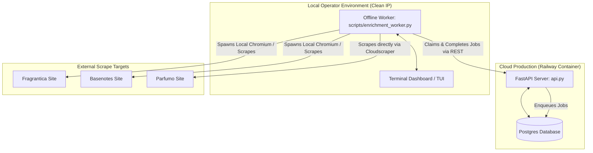

# SRT Scent Engine — System Analysis & Browser Audit Report

This document compiles the comprehensive architectural findings, performance evaluations, headless browser checks, queue mechanisms, and critical risk areas for the **SRT Scent Engine** codebase. It is designed to guide the modifying agent in maintaining, optimizing, and repairing the pipeline.

---

## 1. System Architecture Overview

The SRT Scent Engine uses a **decoupled, process-separated architecture** to search, resolve, and enrich fragrance data from dual sources (**Basenotes** and **Fragrantica**), with **Parfumo** serving as a fallback. 



### Decoupled Execution Model
* **FastAPI Server (`api.py`):** Runs in the cloud (Railway). Since datacenter IPs are immediately blocked by Cloudflare when accessing Fragrantica, the cloud API server **does not perform live scraping**. Instead, it acts as a RESTful job manager.
* **Offline Worker (`scripts/enrichment_worker.py`):** Runs locally on an operator's machine or in a clean IP space. It polls the cloud API for pending jobs, executes the scraping logic, solves Cloudflare challenges (minting sessions via a local Chromium browser), and uploads the structured details back to the cloud API.
* **REST Communication & Security:** The worker communicates with the cloud API through protected REST endpoints (`/api/enrichment/jobs/*`), which are authenticated via an HMAC-based bearer token checked against `ENRICHMENT_WORKER_TOKEN`.
* **Mobile Remote Control Polling:** The local worker TUI polls `/api/enrichment/commands/claim` every 10 seconds. Registered operator accounts can trigger queue overrides (e.g., toggle auto-approve, retry failed jobs) remotely from a mobile app. The worker executes these commands and returns the status.

---

## 2. Headless Browser Audit (Railway Cloud Protection)

A primary design constraint is ensuring that the production FastAPI app running on Railway **never attempts to spawn a browser process** during standard request serving. Spawning browsers in Railway leads to process tree leaks and OOM (Out Of Memory) crashes on resource-constrained containers.

### Audited Browser Libraries
* **DrissionPage:** The codebase utilizes `DrissionPage` (a CDP-based Chromium controller) for browser automation:
  1. [fragrance_parser_full_rewrite_fixed.py](file:///c:/Users/urban/my_project_workspace/search_engine/fragrance_parser_full_rewrite_fixed.py#L48-L49): Imports `ChromiumOptions` and `ChromiumPage` for solving Basenotes and Fragrantica Cloudflare challenges.
  2. [concentration_grabber.py](file:///c:/Users/urban/my_project_workspace/search_engine/concentration_grabber.py#L11): Imports `ChromiumOptions` and `ChromiumPage` inside `SemanticScentEngine.analyze(...)` to scrape DuckDuckGo SERPs.
* **Other Browsers:** No imports or calls to Selenium, Playwright, or Puppeteer are present. The system relies entirely on `DrissionPage` and direct CDP websocket connections.

### Gated Cloud Disabling Logic
* **Environment Gate:** In [nixpacks.toml](file:///c:/Users/urban/my_project_workspace/search_engine/nixpacks.toml#L24), Railway is configured with `DISABLE_CHROMIUM_MINT = "1"`.
* **Code Implementation:** In [fragrance_parser_full_rewrite_fixed.py](file:///c:/Users/urban/my_project_workspace/search_engine/fragrance_parser_full_rewrite_fixed.py#L2807-L2809):
  ```python
  def _chromium_mint_disabled() -> bool:
      return _env_truthy("DISABLE_CHROMIUM_MINT") or _env_truthy("SRT_DISABLE_CHROMIUM_MINT")
  ```
* **Bypass Execution:** In `RoutedScraper._for_url(...)`, the `mint_clearance` parameter is evaluated:
  ```python
  mint_clearance = (
      not _chromium_mint_disabled()
      and _SESSION is None
      and time.monotonic() >= _NEXT_MINT_AFTER
  )
  ```
  Since `DISABLE_CHROMIUM_MINT = "1"`, the engine sets `mint_clearance = False`. Therefore, `_mint_basenotes_clearance` and `_mint_fragrantica_clearance` immediately return `None`, bypassing Chromium spawning entirely.

### Manual Clearance Synchronization
To enable scraping on the cloud without spawning browsers, the API provides manual clearance upload endpoints:
* `POST /api/diagnostics/basenotes/clearance`
* `POST /api/diagnostics/fragrantica/clearance`

Local workers or administrators mint valid `cf_clearance` cookies and User-Agents on their clean local machines and upload them to the cloud. The cloud server caches these cookies to make direct `requests` or `cloudscraper` calls without ever invoking a browser.

### Railway DevTools WebSocket 404 Origin Block
* **Issue:** Under Railway's container network, Chromium's DevTools WebSocket handshake fails with a 404 because Chromium rejects connection upgrades without an explicit `Origin` header.
* **Fix:** The codebase uses `_install_drission_websocket_origin_patch()` in `api.py` and `fragrance_parser_full_rewrite_fixed.py` to intercept and monkey-patch `websocket.create_connection`, forcing `kwargs["origin"] = "http://127.0.0.1"` if none is provided.

---

## 3. Enrichment Worker Pipeline & Resolver Logic

### Database Schema & Persistence
All database logic is contained in [db.py](file:///c:/Users/urban/my_project_workspace/search_engine/db.py) and is initialized automatically via idempotent `CREATE TABLE IF NOT EXISTS` commands in `init_db()`.
1. **`enrichment_jobs`:** Manages the task queue. Key fields: `id`, `job_key` (UNIQUE), `status` (`pending`, `processing`, `completed`, `failed`, `ignored`), `failure_count`, `claim_expires_at` (lease timestamp).
2. **`fg_detail_cache`:** Durable detail cache. Keyed by `canonical_fg_url` (which also stores canonical Parfumo URLs). Fields: `quality_status` (`complete`, `partial`), `frag_cards_json`, `notes_json`, `raw_identity_json`.
3. **`fragrance_records`:** Consolidated aggregate table combining Basenotes and Fragrantica data.

### Task Lifecycle Flow
1. **Enqueue:** User requests details via `/details`. If data is missing or incomplete, a job is enqueued in the `enrichment_jobs` table (status: `'pending'`).
2. **Claim:** The worker polls `/api/enrichment/jobs` and claims a job. The DB executes `claim_job` using a `SELECT ... FOR UPDATE` row lock, setting status to `'processing'` and applying a lease lock (`claim_expires_at`).
3. **Resolve:** The worker checks Fragrantica. If no page is resolved, and `PARFUMO_FALLBACK_ENABLED` is active, it calls the secondary resolver.
4. **Fetch & Format:** Worker fetches and parses the page (FG rating metrics or Parfumo facts).
5. **Complete:** Worker POSTs the payload to `/api/enrichment/jobs/{id}/complete`. The API inserts the details into `fg_detail_cache`, aggregates the data in `fragrance_records` (setting `derived_metrics_json = NULL`), and sets the job status to `'completed'`.

### Secondary Fallback Resolver (Parfumo)
* Gated by `PARFUMO_FALLBACK_ENABLED` (dormant by default).
* Accessible via standard scraper User-Agent (does not require Cloudflare clearance minting).
* Uses Serper.dev site-scoped queries: `site:parfumo.com/Perfumes "<house>" "<name>"`.
* Enforces strict match thresholds: top candidate must score **`>= 0.82`** with a sibling margin of **`>= 0.06`** (`best - runner_up`) to prevent EDT/EDP confusion. Near-misses drop to `manual_review`.

---

## 4. Performance & Memory Optimizations

* **Strong Cache Precheck Fast-Path:** In `api.py:1780`, the `/search` path queries the aggregate database first using `_strong_cache_search`. High-confidence matches are returned in <50ms, skipping the slow live search entirely.
* **Background Cache Refresh Concurrency Limits:** Daemon threads refresh cached searches in the background to keep data fresh. To avoid memory exhaustion on Railway, inflight refreshes are capped at `_WARM_REFRESH_MAX_INFLIGHT = 2` concurrent threads and deduped by query.
* **Lightweight DB Serialization Projection:** DB lookups (`list_jobs`, search lookups) use column projections that exclude heavy JSON fields (`metadata_json`, `frag_cards_json`), minimizing database egress and serialization overhead.
* **pgrep-Free Zombie Chromium Mitigation:** Legacy processes leaked Chromium helper processes on Railway due to `proc.terminate()` only terminating the parent wrapper. The system mitigates this by:
  1. Spawning Chromium with `start_new_session=True`.
  2. Terminating using process groups: `os.killpg(os.getpgid(proc.pid), signal.SIGTERM)`.
  3. Re-writing `_kill_chromiums_for_user_data_dir()` to scan `/proc/*/cmdline` using pure Python, removing the dependency on a system `pgrep` binary.

---

## 5. Critical Pipeline Risks & Failure Modes
> [!IMPORTANT]
> The following 5 risks represent functional bugs and architectural bottlenecks that must be resolved by the modifying agent.

### Risk 1: Sticky Failure Lockout (Work Queue Stalling)
* **Mechanism:** If an enrichment job fails 10 times (due to spelling errors, network timeouts, or transient blocks), it is marked as `'failed'` via `db.fail_job`.
* **The Bug:** In `db.enqueue_job`, if the job already exists in the database, the query updates `requested_count` and `last_requested_at` but **does not reset the status back to `'pending'`** if it is currently `'failed'`.
* **Impact:** Once a job fails permanently, future user requests will increment the counter, but the job remains `'failed'`. It is never pulled by workers again, trapping the fragrance details in a perpetually degraded (BN-only or empty) state.
* **Actionable Fix:** Update `db.enqueue_job`'s `ON CONFLICT DO UPDATE` clause:
  ```sql
  status = CASE WHEN enrichment_jobs.status = 'failed' THEN 'pending' ELSE enrichment_jobs.status END,
  failure_count = CASE WHEN enrichment_jobs.status = 'failed' THEN 0 ELSE enrichment_jobs.failure_count END,
  last_error = CASE WHEN enrichment_jobs.status = 'failed' THEN NULL ELSE enrichment_jobs.last_error END,
  ```

### Risk 2: Parfumo Fallback Partial Churn (DB Write Loop)
* **Mechanism:** Parfumo fallback completions write to `fg_detail_cache` with a canonical Parfumo URL key, empty `frag_cards`, and `quality_status = 'partial'`.
* **The Bug:** In `api.py` line 3905, the API determines whether to enqueue a new enrichment job:
  ```python
  if fragrantica_cache_source == "db" or bool(stored_detail.frag_cards) or _fg_metrics_complete(stored_detail):
      enrichment_status = "completed"
  else:
      enqueued = _enqueue_enrichment_job(selected, req)
  ```
  For Parfumo-enriched rows, `fragrantica_cache_source` is `"aggregate_db"`, `stored_detail.frag_cards` is `{}` (empty), and `_fg_metrics_complete` is `False`.
* **Impact:** Every client request to `/details` for a Parfumo-enriched fragrance triggers a DB write conflict trying to re-enqueue the job, despite the job already being marked `completed` in `enrichment_jobs`. This creates massive database churn on simple read operations.
* **Actionable Fix:** Update the logic in `api.py` to bypass enqueuing if the cached details source is `'parfumo'` or if a `parfumo_url` is present in the database row:
  ```python
  is_parfumo_fallback = (stored_detail.source == "parfumo" or getattr(stored_detail, "parfumo_url", None) is not None)
  if fragrantica_cache_source == "db" or is_parfumo_fallback or bool(stored_detail.frag_cards) or _fg_metrics_complete(stored_detail):
      enrichment_status = "completed"
  ```

### Risk 3: Un-locked Concurrent Aggregate Write Conflicts
* **Mechanism:** In `db.py`, `upsert_fragrance_details` searches for matching records via a `SELECT` query in `_find_fragrance_record_key` and then executes `INSERT ... ON CONFLICT (record_key) DO UPDATE`.
* **The Bug:** This key generation and insertion path is not protected by database transaction locks.
* **Impact:** If multiple users search for an un-cached fragrance concurrently, separate threads will generate duplicate record keys and attempt concurrent insertions. This causes `UniqueViolation` errors on database constraints (such as `canonical_fg_url` or `bn_url`). While FastAPI catches and swallows these exceptions to prevent client crashes, it pollutes production logs and causes redundant transaction rollbacks.
* **Actionable Fix:** Add a transaction lock (e.g. `SELECT FOR UPDATE` or table locks) to `_find_fragrance_record_key` to serialize concurrent aggregate cache writes.

### Risk 4: Read-Triggered Metrics Compute Lag (Thundering Herd)
* **Mechanism:** When a worker completes a job, `complete_job` updates the raw HTML facts but resets `derived_metrics_json = NULL` and `metrics_computed_at = NULL` in `fragrance_records`.
* **The Bug:** Derived metrics (longevity, sillage, accords, etc.) are computed synchronously on the first client read request.
* **Impact:** The first user to load details for a newly enriched fragrance experiences a latency spike while the API calculates metrics and writes the updated row back to the DB. If multiple users load the page concurrently, they all execute `build_derived_metrics` and write to the database simultaneously, causing a thundering herd race condition.
* **Actionable Fix:** Pre-populate `derived_metrics_json` at the time of worker submission. The worker or the `/complete` API handler should calculate derived metrics before writing to the database, ensuring reads are strictly read-only and instantaneous.

### Risk 5: Database Connection Pool Starvation
* **Mechanism:** `db.py` initializes a `psycopg-pool` with `min_size=1, max_size=5`. FastAPI runs all endpoint requests inside a background thread pool because they are declared synchronously (`def` instead of `async def`).
* **The Bug:** The database pool maximum size of 5 restricts the number of active database operations.
* **Impact:** Under moderate concurrent traffic, threads are forced to wait for database connections to release, causing queue stagnation and slow response times, even if container CPU and RAM are underutilized.
* **Actionable Fix:** Increase `max_size` in `db.py` to at least `20` to accommodate concurrent FastAPI request threads, or refactor database interaction to utilize async queries (`async def` with `asyncpg`).
