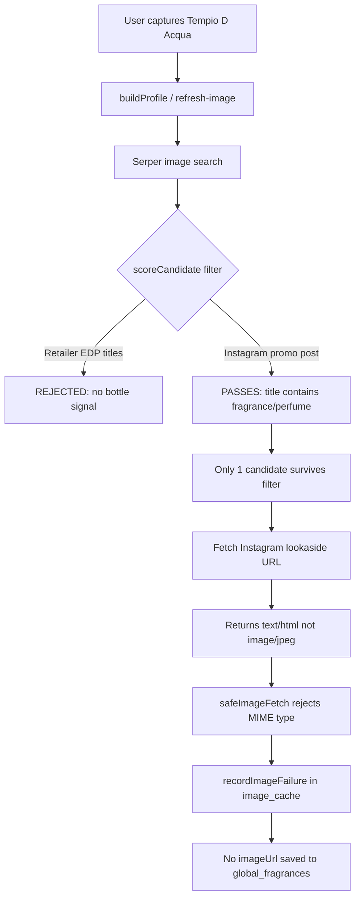

# Investigation: Why image generation failed for Tempio D Acqua (Casamorati 1888)

**Fragrance:** Tempio D Acqua  
**Brand:** Casamorati 1888  
**Investigation date:** 2026-05-23  
**Scope:** Research only — no code or configuration changes were made.

---

## Executive summary

Image generation did **not** fail because this fragrance is obscure or missing from the web. Serper returns multiple high-quality retailer packshots (Twisted Lily, Smallflower). The pipeline failed because **Serper candidate filtering rejects all retailer images** for this product, leaving **only one Instagram URL** that passes filters — and that URL **returns HTML, not an image**, so download/processing fails.

The scent profile (notes, vector, enrichment) was saved successfully; only the bottle image step failed.

---

## Current production state (verified)

### `global_fragrances` (Supabase)

| Field | Value |
|-------|-------|
| `lookup_key` | `casamorati 1888::tempio d acqua` |
| `brand` / `name` | Casamorati 1888 / Tempio D Acqua |
| `profile_data.imageUrl` | `null` |
| `profile_data.product.image_url` | `null` |
| Scent metadata | Present (9 notes, scent vector populated) |
| `updated_at` | 2026-05-23 06:31:07 UTC |

### `image_cache` (Supabase)

One failed row exists for this lookup key:

| Field | Value |
|-------|-------|
| `lookup_key` | `casamorati 1888::tempio d acqua` |
| `source_provider` | `serper` |
| `source_url` | `https://lookaside.instagram.com/seo/google_widget/crawler/?media_id=3859312112938049770` |
| `processing_status` | **`failed`** |
| `failure_reason` | **`Image processing failed`** |
| `public_url` | `null` |
| `created_at` | 2026-05-23 06:31:07 UTC (same moment as catalog write) |

### Live API check

```
POST https://scast-production.up.railway.app/api/refresh-image
Body: { "brand": "Casamorati 1888", "name": "Tempio D Acqua" }

→ 404 { "error": "No image found for this fragrance" }
```

### Enrichment job (Railway `enrichment_jobs`)

| Field | Value |
|-------|-------|
| `id` | `8e3be2a2-2899-4274-85d5-cadc37e22887` |
| `status` | **`completed`** |
| `fg_url` at enqueue | `null` (resolved during processing) |
| `last_error` | `null` |

Enrichment succeeded for notes/metadata. Image resolution is a **separate step** in `buildProfile` / `resolveProcessedFragranceImage`, not part of the enrichment worker payload.

---

## Failure chain (step by step)



---

## Root cause #1: Over-strict Serper pre-filter (`serperService.ts`)

File: `huge_monorepo/artifacts/api-server/src/services/serperService.ts`

The `scoreCandidate()` function requires either:

1. A **trusted host** (fragrantica, sephora, ulta, etc.), **or**
2. Title/source text containing one of: `perfume`, `fragrance`, `bottle`, `eau de parfum`, `eau de toilette`

Retailer listings for this fragrance use titles like:

- `Casamorati Tempio d'Acqua EDP (100 ml)` — Twisted Lily
- `Casamorati Tempio d'Acqua EDP (100 ml) - Smallflower`

**"EDP" is not in `REQUIRED_TEXT_HINTS`**, and Twisted Lily / Smallflower are not in `TRUSTED_HOST_HINTS`. Result: **score = -Infinity (filtered out)**.

### Simulated ranking of live Serper results (10 images, 2026-05-23)

| Google position | Source | Filter outcome | Reason |
|-----------------|--------|----------------|--------|
| 1 | Twisted Lily (2000×2000 JPEG) | **REJECTED** | no bottle signal / not trusted |
| 2 | Smallflower (1946×1946 PNG) | **REJECTED** | no bottle signal / not trusted |
| 3 | Twisted Lily 30ml | **REJECTED** | no bottle signal / not trusted |
| 4–5 | Smallflower variants | **REJECTED** | no bottle signal / not trusted |
| 6 | Jomashop (wrong Mefisto image) | **REJECTED** | too small (350×350) |
| 7, 9, 10 | Instagram review reels | **REJECTED** | blocked text (`review`) |
| **8** | **Instagram promo post** | **PASSES (score 7)** | title contains `fragrance`, `perfume` |

**Only 1 of 10 Serper results survives filtering.** The pipeline then tries at most 5 candidates (`MAX_CANDIDATES_PER_ATTEMPT`), but only this single Instagram URL is eligible.

---

## Root cause #2: Instagram lookaside URLs are not fetchable as images

The surviving candidate URL:

```
https://lookaside.instagram.com/seo/google_widget/crawler/?media_id=3859312112938049770
```

HTTP probe (2026-05-23):

| URL | Status | Content-Type |
|-----|--------|--------------|
| Instagram lookaside (above) | 200 | **`text/html; charset=utf-8`** |
| Twisted Lily packshot | 200 | **`image/jpeg`** |

The image pipeline uses `safeImageFetch.ts`, which only accepts `image/jpeg`, `image/png`, `image/webp`, `image/avif`, `image/gif`. HTML responses throw:

```
Unsupported image content type: text/html
```

That surfaces as **`Image processing failed`** in `image_cache.failure_reason` (see `imagePipeline.ts` → `processCandidate` catch block).

Instagram is also **not** in `BLOCKED_HOST_HINTS`, so social crawler URLs are not blocked at the host level — they can win ranking when legitimate retailers are filtered out.

---

## Root cause #3 (contributing): No Fragrantica bottle image fallback

- Fragrantica page exists: https://www.fragrantica.com/perfume/Casamorati-1888/Tempio-d-Acqua-128356.html
- This is a **2026 new release**; the page appears to have **no official bottle photo** in page content (no product image in fetched HTML; scraper returned `image_url: null`).
- `scentEngineCore.ts` builds profiles with a Serper search query like:
  `"Casamorati 1888 Tempio D Acqua single fragrance bottle no box HQ product photo studio no plants"`
- If Serper pipeline returns null and enrichment provides no `imageUrl` fallback, the profile is saved **without** an image (non-fatal — see `reportNonFatalError` for `scentEngine.imageResolution`).

---

## Why this feels like “we should find this easily”

The user intuition is correct:

1. **Google/Serper has good packshots** at positions 1–5 (Twisted Lily, Smallflower — 1445–2000px square product photos).
2. **Our filter removes them** before the pipeline ever tries to download them.
3. **The one URL we do try** is an Instagram SEO crawler link that does not serve raw image bytes to our fetcher.
4. **Fragrantica** has the listing but not a bottle asset yet for this very new release.

So the failure is a **pipeline logic bug**, not missing catalog data.

---

## Related context (enrichment vs image)

A prior issue affected **Fragrantica URL resolution** for this same fragrance (designer catalog year `1888` vs launch year `2026` causing identity score 0). That was fixed separately in `fragrance_parser_full_rewrite_fixed.py` (`pick_launch_year`). The enrichment job for Tempio D Acqua is now **`completed`**.

**Image generation is independent** of that fix and still fails for the reasons above.

---

## Relevant code locations

| Component | Path |
|-----------|------|
| Serper candidate scoring / filtering | `huge_monorepo/artifacts/api-server/src/services/serperService.ts` — `scoreCandidate()` |
| Image pipeline orchestration | `huge_monorepo/artifacts/api-server/src/services/imagePipeline.ts` — `resolveProcessedFragranceImage()` |
| SSRF-safe image download | `huge_monorepo/artifacts/api-server/src/services/safeImageFetch.ts` |
| Profile build + default search query | `huge_monorepo/artifacts/api-server/src/services/scentEngineCore.ts` |
| Refresh-image API | `huge_monorepo/artifacts/api-server/src/routes/scent.ts` |
| Failed attempt caching | `huge_monorepo/artifacts/api-server/src/services/imageCacheService.ts` — `recordImageFailure()` |
| Edge-case playbook | `huge_monorepo/artifacts/api-server/docs/scent-trunk-image-pipeline-edge-cases.md` |

---

## Hypothetical fixes (not implemented — research only)

These are documented for future work; **nothing was changed** during this investigation.

1. **Treat `edp` / `edt` / `extrait` as bottle signals** in `REQUIRED_TEXT_HINTS`, or relax the trusted-host / bottle-signal gate for high-resolution retailer CDN hosts (e.g. `cdn.shop`, `smallflower.com`, `twistedlily.com`).
2. **Block or deprioritize** `lookaside.instagram.com` and similar social crawler URLs in `BLOCKED_HOST_HINTS`.
3. **When all Serper-filtered candidates fail**, retry with a looser filter tier (similar to the “clarify path” in `scent-trunk-image-pipeline-edge-cases.md`).
4. **Use Fragrantica `fimgs.net` images** when present; for new releases without FG photos, prefer retailer domains that pass dimension checks even without keyword matches in title text.

---

## Reproduction checklist

1. Query Supabase `image_cache` for `lookup_key = 'casamorati 1888::tempio d acqua'` → expect `processing_status = failed`, Instagram `source_url`.
2. Call Serper Images API with query matching production:
   `Casamorati 1888 Tempio D Acqua single fragrance bottle no box HQ product photo studio no plants`
   → observe retailer images at top of raw results.
3. Run `scoreCandidate()` logic on those results → observe retailer rows scored `-Infinity`, single Instagram promo row passes.
4. HEAD/GET Instagram lookaside URL → `Content-Type: text/html`.
5. HEAD/GET Twisted Lily CDN URL → `Content-Type: image/jpeg`.
6. POST `/api/refresh-image` → `404 No image found for this fragrance`.

---

## Conclusion

**Tempio D Acqua (Casamorati 1888) image generation failed because the Serper pre-filter eliminated all usable retailer packshots (EDP shorthand titles, untrusted hosts), leaving a single Instagram crawler URL that cannot be downloaded as an image.** The failure was recorded in `image_cache` and the catalog row was written without `imageUrl`. Good images exist on the public internet; the pipeline never attempted to use them.
